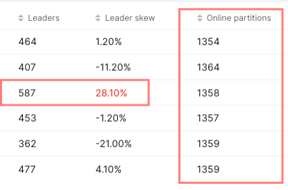
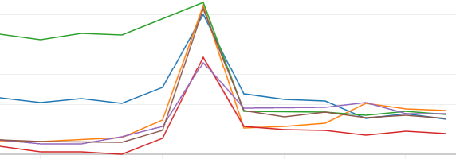

# Kafka - Reassign Partitions & Brokers

When working with Kafka, increasing or decreasing the number of brokers isn't as trivial as it seems. If you add a new broker, 
it will stand there doing nothing. You have to manually reassign partitions of your topics to the new broker. 
But you don't want to just move some topics completely to your new broker, you want to spread your partitions are they replicas equitably across all your brokers. 
You also want to have the number of leader partitions balanced across all your brokers.

# Reassign partitions
To reassign partitions to different brokers, you can use the Kafka binaries (`bin/kafka-reassign-partitions.sh`), 
but it isn't trivial if you have to reassign thousands of topics.

The binary file has three operations: 
- `--generate`. This will generate a plan to reassign partitions.
- `--execute`. This will execute the plan.
- `--verify`. This will verify the status of the reassignment.

:::tip
A throttle can be set to avoid overloading the brokers, and the throttle will remain in the cluster after the reassignment, 
until a `--verify` is run when the reassignment has finished, so it's highly recommended to run `--verify` 
until you are sure all the partitions have been reassigned.
:::


To create a plan, you have to pass a JSON file with the topics you want to reassign and the brokers you want to reassign them to.
e.g.: 
```json
{
  "topics": [
    { "topic": "foo1" },
    { "topic": "foo2" }
  ],
  "version": 1
}
```
And it will generate you a file like this:
```json
{"version":1,
  "partitions":[{"topic":"foo1","partition":0,"replicas":[2,1],"log_dirs":["any"]},
    {"topic":"foo1","partition":1,"replicas":[1,3],"log_dirs":["any"]},
    {"topic":"foo1","partition":2,"replicas":[3,4],"log_dirs":["any"]},
    {"topic":"foo2","partition":0,"replicas":[4,2],"log_dirs":["any"]},
    {"topic":"foo2","partition":1,"replicas":[2,1],"log_dirs":["any"]},
    {"topic":"foo2","partition":2,"replicas":[1,3],"log_dirs":["any"]}]
}
```
The input expects you to give the list of brokers (1,2,3,4,5...) and this JSON with the whole list of partitions and replicas.

:::warning
The first number in `"replicas":[1,3]` is the leader partition, the rest are the followers. 
This is very important because you might end up with more leader partitions in a broker than others, increasing its workload
:::

## Problem with Kafka Reassign tool

When you need to reassign a big cluster, you might find some issues with the `--generate` command:

- The plan generated is completely random. Running it twice for a topic will produce different results.
- The plan generated is not always optimal. It might assign more partitions to one broker than to another.

On a cluster with thousands of partitions this might be ok, as probably randomizing the partitions will be enough to balance them across the brokers,
but it might not be completely optional.
Also, if you need to run this for a lot of topics, and you want to do it on batches, you don't want to run the `--generate` command for a topic twice, 
in that case, you will be reassigning a topic that was already reassigned.

## Building a custom reassign plan.

To manage partitions more properly, a custom tool can be built, where partitions are defined based on the topic name and the list of brokers. 
By doing this, reassigning partitions on the same topic twice won't produce any changes. A tool like that can be used to manage the reassignment of partitions in a more controlled way.

# Balance Leader partitions
After reassigning a lot of partitions, the leader partitions might not be well-balanced across your brokers. 
This means that a broker might have more leader partitions than other brokers, which is translated into more workload.
An example in Kafka-UI:


If you wait, the cluster probably will rebalance the leader partitions on its own (if `auto.leader.rebalance.enable=true` is set).

In order to force a rebalance, you can use the `bin/kafka-leader-election.sh` binary.

This an example of the CPU usage of brokers before and after the leader election:


e.g.:
```shell
$ bin/kafka-leader-election.sh --bootstrap-server localhost:9092 --election-type preferred --all-topic-partitions
```
`--election-type` can be `preferred` or `unclean`. `preferred` will try to move the leader partition to the preferred broker, `unclean` will move the leader partition to any broker.


# TL;DR

To reassign partitions to new brokers:

- Use the `bin/kafka-reassign-partitions.sh` with a list of topics, brokers and the `--generate` command.
- Use the `bin/kafka-reassign-partitions.sh` with the generated JSON and the `--execute` command.
- Use the `bin/kafka-reassign-partitions.sh` with the generated JSON and the `--verify` command.
- Use the `bin/kafka-leader-election.sh` to balance the leader partitions across your brokers.


