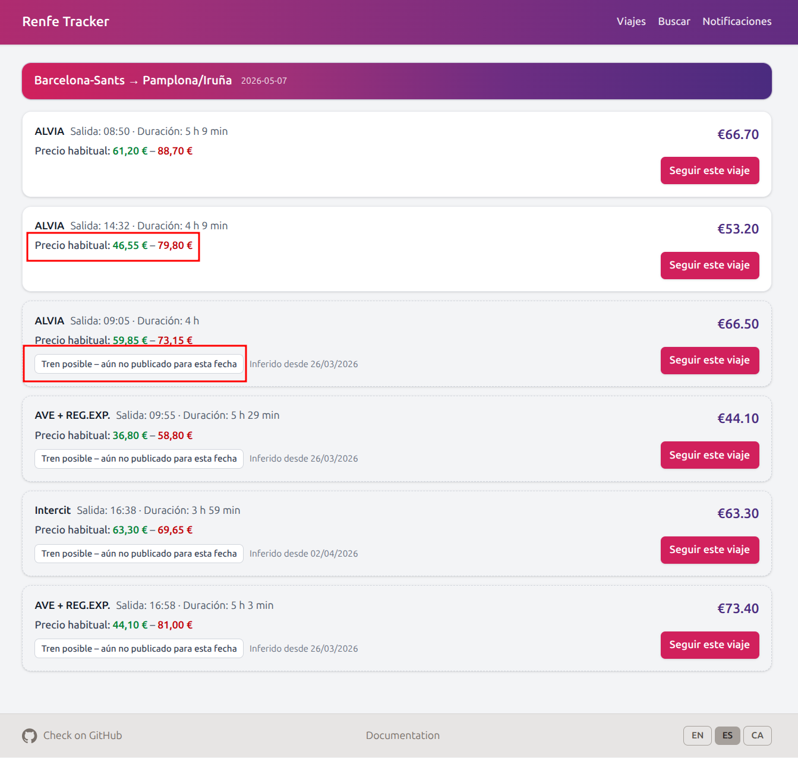

[renfe-tracker](https://github.com/JavierMonton/renfe-tracker) is a self-hosted tool I built to track Renfe train prices (media and larga distancia) and get notified when they change.

<!-- truncate -->

## Why

Renfe prices fluctuate a lot, and checking manually every day is tedious. I wanted something that would watch a trip for me and alert me when the price dropped — or before it went up.

## What it does

- **Search trains** between stations for a given date, with estimated price ranges based on historical data
- **Detect possible trains** — trains expected to appear on your date based on recurring patterns, even before Renfe publishes them
- **Track trips** and monitor their prices automatically in the background
- **Alert you** when the price changes via email, Telegram, Home Assistant, or browser notifications
- **View price history** with a timeline of every price change for a tracked trip

## Screenshots

### Search



### Tracked trips


### Price history


### Notifications


## Getting started

It runs as a single Docker container:

```bash
curl -o docker-compose.yml https://raw.githubusercontent.com/JavierMonton/renfe-tracker/main/docker-compose.example.yml
docker compose up -d
```

Then open [http://localhost:8000](http://localhost:8000).

Full documentation at [javiermonton.github.io/renfe-tracker](https://javiermonton.github.io/renfe-tracker/) and source code on [GitHub](https://github.com/JavierMonton/renfe-tracker).
